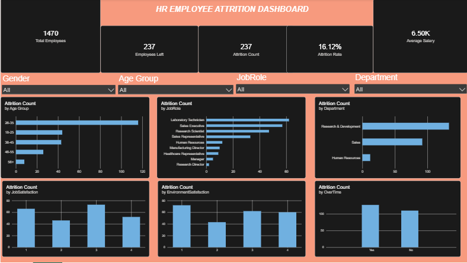

# SCT_DS_3 – HR Employee Attrition Dashboard

## 📊 Project Overview

This project is an interactive **HR Employee Attrition Dashboard** developed using **Microsoft Power BI**.

The dashboard provides insights into employee attrition based on different factors such as age group, job role, department, job satisfaction, environment satisfaction, overtime, and other employee-related attributes.

## 🎯 Objectives

- Analyze employee attrition patterns
- Identify departments and job roles with higher attrition
- Analyze attrition across different age groups
- Understand the impact of job and environment satisfaction
- Compare attrition based on overtime
- Present key HR insights through interactive visualizations

## 📌 Dashboard Features

- Total Employees
- Employees Left
- Attrition Count
- Attrition Rate
- Average Salary
- Gender Filter
- Age Group Filter
- Job Role Filter
- Department Filter
- Attrition by Age Group
- Attrition by Job Role
- Attrition by Department
- Attrition by Job Satisfaction
- Attrition by Environment Satisfaction
- Attrition by Overtime

## 🛠️ Tools & Technologies

- Microsoft Power BI
- Power Query
- DAX
- Data Visualization
- HR Analytics

## 📷 Dashboard Preview

## 📁 Project Files

- `Task3_HR_Dashboard.pbix` – Power BI dashboard file
- `HR_Attrition_Dashboard.png` – Dashboard preview
- `README.md` – Project documentation

## 📈 Key Insights

The dashboard helps identify patterns in employee attrition and provides a clear visual representation of HR-related trends across departments, job roles, age groups, satisfaction levels, and overtime.

## 👨‍💻 Author

**Yash Madaan**

GitHub: [yashmadaan23](https://github.com/yashmadaan23)
